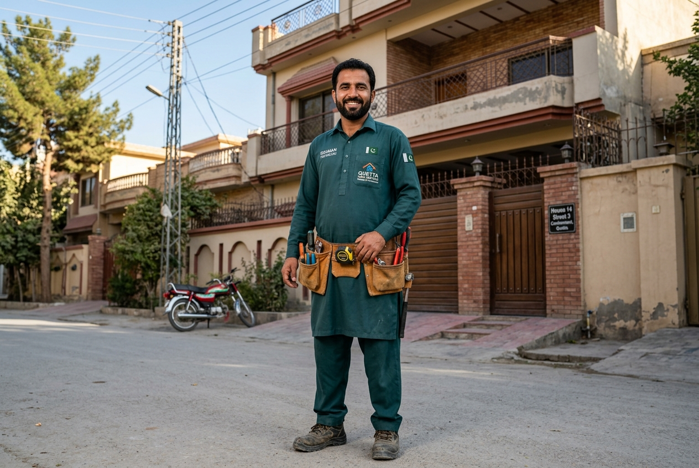

# HomeFix Quetta — On-Demand Home Services Platform

<div align="center">



### **Modern, Full-Stack On-Demand Home Maintenance & Repair Platform for Quetta, Balochistan**

**Conceived, Designed & Developed by:** **Rashid Ali**  
*Final Project for **AI Web Development** | **Balochistan Youth Empowerment (DTAN)** — Digital Balochistan by Digital Transformation Awareness Network*

[](https://github.com/Dopevibe)
[-blue?style=for-the-badge)](https://github.com/Dopevibe)
[](https://www.php.net/)
[](https://www.mysql.com/)
[](https://tailwindcss.com/)
[](https://greensock.com/gsap/)

[🌐 Live Demo Website](https://homefixquetta.infinityfreeapp.com/) • [📄 Project Report (PDF)](https://homefixquetta.infinityfreeapp.com/HomeFix_Quetta_Project_Report.pdf) • [🗄️ Database Script](database/homefix_quetta.sql) • [👤 Developer Profile](https://github.com/Dopevibe)

</div>

---

## 📋 Final Project Submission Checklist & Deliverables

| Deliverable | Description | Link / Location |
| :--- | :--- | :--- |
| 🌐 **Live Website Link** | Deployed, publicly accessible web application on live server | [https://homefixquetta.infinityfreeapp.com/](https://homefixquetta.infinityfreeapp.com/) |
| 💻 **GitHub Repository** | Clean, well-commented source code repository | [https://github.com/Dopevibe/homefix-quetta](https://github.com/Dopevibe/homefix-quetta) |
| 🗄️ **Database Script** | Complete working `.sql` dump file with schema & seed data | [`database/homefix_quetta.sql`](database/homefix_quetta.sql) |
| 🎥 **Demo Video** | 3–5 minute video walkthrough demonstrating core features | Provided in project submission portal |
| 📄 **Project Report** | 3-page comprehensive document covering problem, architecture & AI tools | [📄 HomeFix_Quetta_Project_Report.pdf](https://homefixquetta.infinityfreeapp.com/HomeFix_Quetta_Project_Report.pdf) |

---

## 🗄️ Database Script & Schema Overview

The complete SQL dump file is located in the repository at [`database/homefix_quetta.sql`](database/homefix_quetta.sql).

### Database Schema Structure:
* **`users`**: Manages accounts with strict session isolation between `admin` and `customer` roles.
* **`categories`**: 4 primary service categories (Plumbing, Electrical, Painting, Handyman).
* **`services`**: 12 detailed service packages with pricing, estimated duration, and checklists.
* **`technicians`**: Verified technician profiles with ratings, experience, and live availability toggles.
* **`bookings`**: Booking records linked with auto-generated references (`HFQ-XXXXXX`), customer identities, status pipelines, and photo attachments.
* **`reviews`**: 5-star rating system with customer feedback and moderation status.
* **`gallery`**: Before and after interactive photo showcase.
* **`contact_messages`**: Public inquiry forms and contact records.
* **`settings`**: System metadata, office location in Satellite Town Quetta, contact numbers, and working hours.

### Quick Database Import Instructions:
1. Open **phpMyAdmin** or your MySQL client.
2. Create a new database named `homefix_quetta` (Collation: `utf8mb4_unicode_ci`).
3. Click the **Import** tab.
4. Choose the file [`database/homefix_quetta.sql`](database/homefix_quetta.sql) and click **Go** / **Execute**.
5. All 9 tables with complete sample records and admin/customer test accounts will be created instantly.

---

## 💡 Original Idea & Vision

The concept for **HomeFix Quetta** was envisioned and developed by **Rashid Ali** to address a critical real-world challenge in Quetta, Balochistan: the lack of a centralized, trustworthy, and digitally organized on-demand home maintenance service.

Homeowners in Quetta often struggle with finding verified plumbers, electricians, painters, and handymen who arrive on time with transparent pricing. **HomeFix Quetta** solves this by delivering a modern, localized digital ecosystem bridging residents across all major Quetta sectors (Satellite Town, Jinnah Town, Cantt, Zarghoon Road, Airport Road, Samungli Road, etc.) with certified, background-checked trade professionals.

---

## 🎓 Academic & Program Attribution

This application represents the **Final Capstone Project** for:
* **Course / Track**: AI Web Development
* **Initiative**: Balochistan Youth Empowerment Program (DTAN)
* **Organization**: Digital Balochistan by Digital Transformation Awareness Network (DTAN)
* **Lead Architect & Developer**: Rashid Ali

---

## 📌 Executive Summary

**HomeFix Quetta** is a production-grade, full-stack web application built from the ground up to handle real customer bookings, live technician dispatches, automated notifications, interactive geolocations, and complete business operations for 4 essential trades:
1. 🔧 **Plumbing & Water Tanks** (Pipe leaks, sanitary fittings, overhead tank cleaning, motor installation)
2. ⚡ **Electrical & Solar UPS** (UPS inverter wiring, DB breaker fixes, solar panel wiring, lighting)
3. 🎨 **Wall Painting & Waterproofing** (WeatherShield exterior, interior emulsion, roof seepage proofing)
4. 🔨 **Handyman & Wall Mounting** (LED TV brackets, curtain rods, door lock fittings, appliance repair)

---

## ✨ Core System Architecture & Features

### 1. 🏡 Public Customer Experience
- **Fluid Micro-Interactions**: Powered by GSAP & native CSS transitions for smooth page entrances, button states (`loading` → `success` → `reset`), and interactive toasts.
- **Dynamic Services Catalog**: Real-time AJAX live search with query debouncing, category pills filtering, and instant PKR rate card calculation.
- **Service Detail Deep-Dives**: Comprehensive service scope, "What's Included" checklist, typical durations, fixed rates, and genuine customer feedback.
- **Multi-Step Booking Wizard**: Fast scheduling selecting service, Quetta neighborhood, time slots, problem description, and optional photo attachment with instant live preview.
- **Real-Time Booking Tracker**: Live visual tracker (`Pending` → `Confirmed` → `Assigned` → `In Progress` → `Completed`) with assigned technician details and direct helpline hotline.
- **Interactive Quetta Hubs Map**: Leaflet.js and OpenStreetMap integration plotting specialized dispatch hubs across Quetta.
- **Before & After Work Showcase**: Interactive comparison slider showcasing actual repair results.

### 2. 👤 Customer Account Dashboard
- **Secure Authentication**: BCRYPT password hashing (`password_hash()`), secure sessions, and role-based access control.
- **Active & Historical Bookings**: Real-time status cards, detailed service summaries, and self-service cancellation for pending bookings.
- **Verified Review Engine**: 5-star rating submission with written testimonials on completed service orders.
- **Profile Management**: Instant address and contact details updates with lightweight AJAX toasts.

### 3. 🛡️ Administrative Operations Console (`/admin`)
- **Real-Time Business KPI Dashboard**: Revenue analytics in PKR, active requests, unassigned dispatches, available technicians, and registered customer metrics.
- **Bookings Pipeline & Dispatch**: Status filtering, 1-click on-duty technician assignment, lifecycle transitions, and deletion with SweetAlert2 confirmation modals.
- **Service & Category CRUD**: Full creation, photo uploading, pricing updates, and featured status toggles.
- **Technician Management**: Roster tracking verified CNIC background checks, trade specialties, ratings, and live availability toggles (`available`, `busy`, `offline`).
- **Review Moderation Queue**: Approve, hide, or moderate incoming customer reviews.
- **Customer Directory & Inquiries Inbox**: Customer order metrics and support contact message management.
- **SaaS-Grade Admin Settings**: Interactive avatar upload, live image preview, password strength meter, confirmation validator, and system metadata audit panel.

---

## 🔒 Security & Performance Engineering

1. **100% Prepared PDO Statements**: All SQL queries utilize parameterized statements with `PDO::ATTR_EMULATE_PREPARES => false`, eliminating SQL Injection attack vectors.
2. **Robust Password Security**: Passwords hashed using industry-standard BCRYPT algorithms (`PASSWORD_BCRYPT`) and verified using constant-time string comparison (`password_verify()`).
3. **Safe Exception & Error Handling**: AJAX controllers and database layers log technical errors privately with `error_log()` while returning clean, user-friendly responses.
4. **XSS & Output Sanitization**: Strict HTML entity encoding via helper `e()` (`htmlspecialchars()`).
5. **Secure Multi-MIME Upload Validation**: Validates image binary MIME headers using PHP `finfo` (`image/jpeg`, `image/png`, `image/webp`), enforces 5MB size limits, and generates randomized alphanumeric filenames (`uniqid()`).
6. **Clean URL Engine & Apache Hardening**: Extensionless routing eliminating ugly `.php` extensions while blocking direct web access to `.sql`, `.env`, and configuration directories.

---

## 🛠️ Technology Stack

| Layer | Technology | Purpose |
|---|---|---|
| **Backend Runtime** | PHP 8.0+ | Server-side runtime, business logic, session guards |
| **Database** | MySQL 8.0+ / MariaDB | Relational storage with InnoDB engines, foreign keys & indexes |
| **Frontend Styling** | Tailwind CSS 3.4 CDN | Responsive modern utility-first styling system |
| **UI Components** | Lucide Icons, SweetAlert2 | Scalable vector iconography and interactive dialogs |
| **Animation Engine** | GSAP 3.12, ScrollTrigger | Hardware-accelerated motion and scroll-based triggers |
| **Maps & Geo** | Leaflet.js 1.9, OpenStreetMap | Interactive Quetta service hub geolocation map |
| **HTTP / AJAX** | Vanilla JS ES6+ & jQuery 3.7 | Asynchronous non-blocking API interactions |

---

## 📂 Project Directory Structure

```
homefix-quetta/
│   ├── dashboard.php              # Analytics KPIs & business metrics
│   ├── gallery.php                # Before & after project showcase management
│   ├── login.php                  # Secure admin authorization portal
│   ├── logout.php                 # Admin session termination
│   ├── messages.php               # Support contact inquiries inbox
│   ├── reviews.php                # Customer review moderation queue
│   ├── services.php               # Service catalog management & pricing CRUD
│   └── technicians.php            # Technician roster & availability toggles
│
├── ajax/                          # RESTful JSON Endpoint Controllers
│   ├── admin.php                  # Administrative CRUD operations & assignments
│   ├── auth.php                   # Authentication, registration & profile updates
│   ├── bookings.php               # Booking creation, cancellations & tracking lookup
│   ├── contact.php                # Contact message dispatch
│   ├── reviews.php                # Customer review submission
│   └── services.php               # Dynamic live catalog search & filtering
│
├── assets/                        # Frontend Static Assets
│   ├── css/
│   │   └── style.css              # Custom motion tokens, glassmorphism & components
│   ├── js/
│   │   ├── main.js                # Core HF interaction engine & animation controller
│   │   ├── booking.js             # Booking validation & image preview handler
│   │   ├── services.js            # Live search debouncing & filter state
│   │   └── admin.js               # Admin AJAX handlers & SweetAlert2 confirmations
│   └── images/                    # Service covers, avatars, hero photography
│
├── config/                        # Core Application Configuration Layer
│   ├── config.php                 # Global constants, Quetta areas, security helpers
│   └── database.php               # Singleton PDO connection layer with cloud env support
│
├── database/                      # Relational Schema & Seeding
│   └── homefix_quetta.sql         # Clean SQL schema with verified Quetta seed data
│
├── includes/                      # Reusable Layout Components & Middleware
│   ├── admin_auth.php             # Admin RBAC authentication guard
│   ├── admin_footer.php           # Admin footer & shared modal scripts
│   ├── admin_header.php           # Admin HTML head & stylesheet includes
│   ├── admin_sidebar.php          # Admin navigation sidebar with live counters
│   ├── auth.php                   # Customer authentication guard
│   ├── footer.php                 # Global footer & 4-card feature highlights
│   ├── header.php                 # Master HTML head, SEO meta tags & CDNs
│   └── navbar.php                 # Sticky glassmorphism header & emergency hotline
│
├── uploads/                       # Secure User & Admin File Uploads
│   ├── bookings/                  # Customer problem image attachments
│   ├── gallery/                   # Before & after project photos
│   ├── services/                  # Service thumbnail graphics
│   └── technicians/               # Technician profile avatars
│
├── .htaccess                      # Production Apache configuration & clean URLs
├── .gitignore                     # Git tracking exclusions
├── 404.php                        # Branded 404 Page Not Found
├── 500.php                        # Branded 500 Server Error Page
├── about.php                      # About HomeFix Quetta, mission & metrics
├── booking.php                    # Multi-step booking form page
├── contact.php                    # Office location, hotline & contact form
├── dashboard.php                  # Customer portal dashboard
├── DEPLOYMENT_GUIDE.md            # Free cloud hosting deployment walkthrough
├── index.php                      # Homepage landing page
├── login.php                      # Customer sign-in page
├── logout.php                     # Customer sign-out handler
├── register.php                   # Customer registration with password strength meter
├── service-details.php            # Single service detail breakdown
├── services.php                   # Full service catalog directory & filter
├── test.php                       # Live server diagnostics script
├── tracking.php                   # Real-time booking status tracker
└── README.md                      # Comprehensive project documentation
```

---

## ⚡ Quickstart & Local Installation Guide

### Prerequisites
- PHP 8.0 or higher
- MySQL 8.0+ or MariaDB 10.4+
- Web server (Apache, Nginx, or PHP built-in server)
- XAMPP / WampServer (Optional, for all-in-one local setup)

### 1. Clone or Copy the Repository
```bash
git clone https://github.com/your-username/homefix-quetta.git
cd homefix-quetta
```

### 2. Import the Database Schema
1. Open **phpMyAdmin** (`http://localhost/phpmyadmin`) or your MySQL client.
2. Create a database named `homefix_quetta` with collation `utf8mb4_unicode_ci`.
3. Import the file `database/homefix_quetta.sql`.

### 3. Configure Database Credentials (Optional)
If your local MySQL uses a custom password or port, adjust `config/database.php` or set environment variables:
```php
self::$host = '127.0.0.1';
self::$db   = 'homefix_quetta';
self::$user = 'root';
self::$pass = '';
self::$port = 3306;
```

### 4. Run the Development Server
Using PHP's built-in web server:
```bash
php -S 127.0.0.1:8088
```
Or place the folder inside `C:\xampp\htdocs\` and visit `http://localhost/homefix-quetta/`.

---

## 🔑 Administrative & Demo Access

| Role | Email | Password | Access Path |
|---|---|---|---|
| **Administrator** | `admin@homefix.pk` | `Admin@123` | `/admin/login.php` |
| **Customer Account** | `customer@homefix.pk` | `Customer@123` | `/login` |

---

## 🌐 Free Production Deployment

## 👨‍💻 Project Credits & Attribution

* **Project Concept & Original Idea**: **Rashid Ali**
* **Lead Developer & Software Architect**: **Rashid Ali**
* **Academic Program**: Final Project for **AI Web Development**
* **Initiative**: **Balochistan Youth Empowerment (DTAN)**
* **Platform**: **Digital Balochistan by Digital Transformation Awareness Network**
* **Location**: Quetta, Balochistan, Pakistan

*Crafted with dedication by **Rashid Ali** to empower the local workforce and bring modern, reliable on-demand home maintenance to the people of Quetta, Balochistan.*
